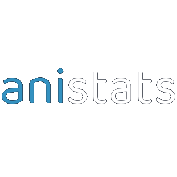

# anistats


:jp: Extend your AniList stats with series-specific data, daily overview and weekly chart :dango:

[Try it yourself](https://mayudev.github.io/anistats/)

## Development
* Node.js and npm

### Setup
```bash
npm install
npm run serve
```