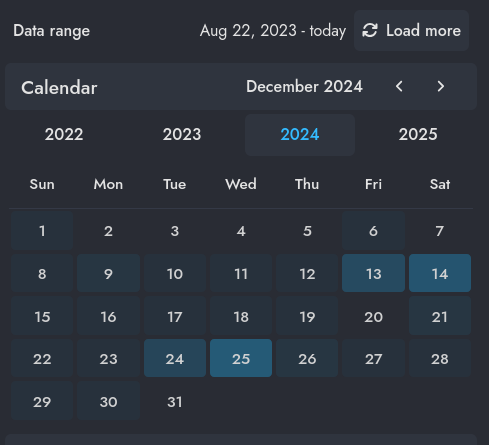
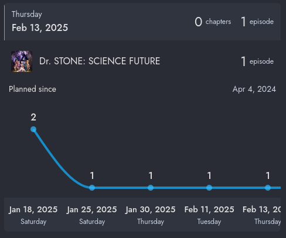
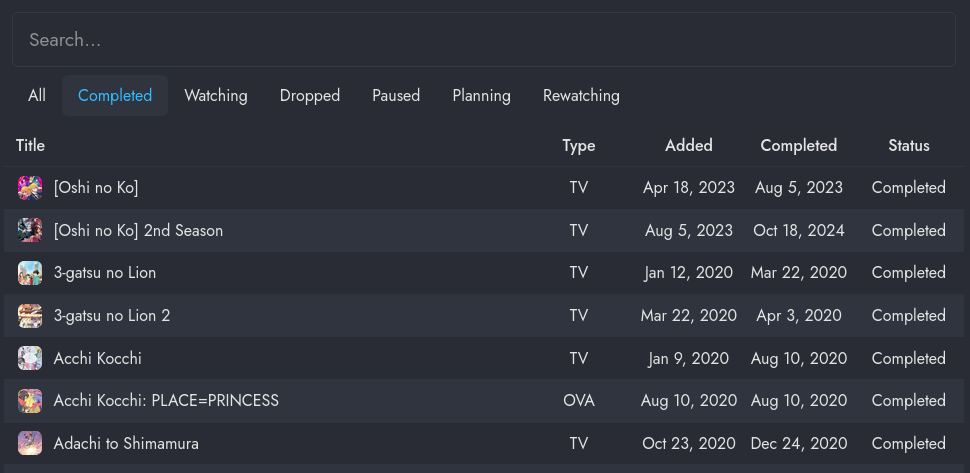

# anistats

Extended statistics for a popular anime and manga progress tracking website, [AniList](https://anilist.co)

[Try it yourself](https://mayudev.github.io/anistats)

## Stack

This app is written using Vue with TypeScript, powered by Vite. The API uses GraphQL.

## Screenshots

### Development

- Development: `npm run dev`
- Build for production: `npm run build`
- Run tests: `npm run test:unit`
